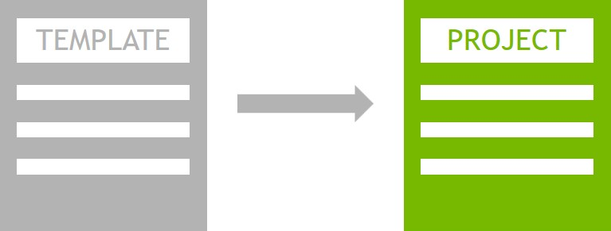

# NVIDIA-AI-IOT Template project

<p align="center">

</p>

This repository demonstrates the minimum requirements of repositories hosted 
under NVIDIA-AI-IOT.  It includes the required naming convention, a LICENSE.md,
and a README.md with appropriate content formatting.

* [Example Section A](#example_section_a)
  * [Example Subsection](#example_subsection)
* [Example Section B](#example_section_b)

<a name="example_section_a"></a>
## Example Section A

This is the text of the first section.  It can be whatever.  Notice in the raw
markdown how we specify the header linke with the  following code

```markdown
<a name="example_section_a"></a>
```

We also add these links above the other section headers below.

Then, we manually create the table of contents above. The code for the table of 
contents looks like this

```markdown
* [Example Section A](#example_section_a)
  * [Example Subsection](#example_subsection)
* [Example Section B](#example_section_b)
```

<a name="example_subection"></a>
### Example Subsection 

This is the text of a subsection.  It too can be whatever.

<a name="example_section_b"></a>
## Example Section B

Some more random text.
